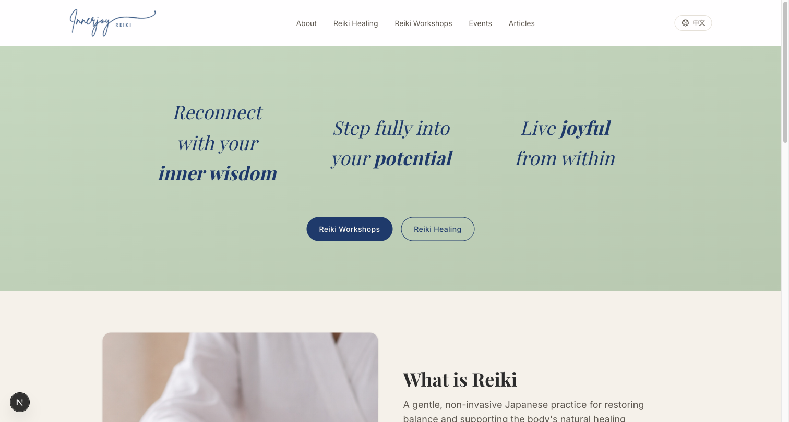
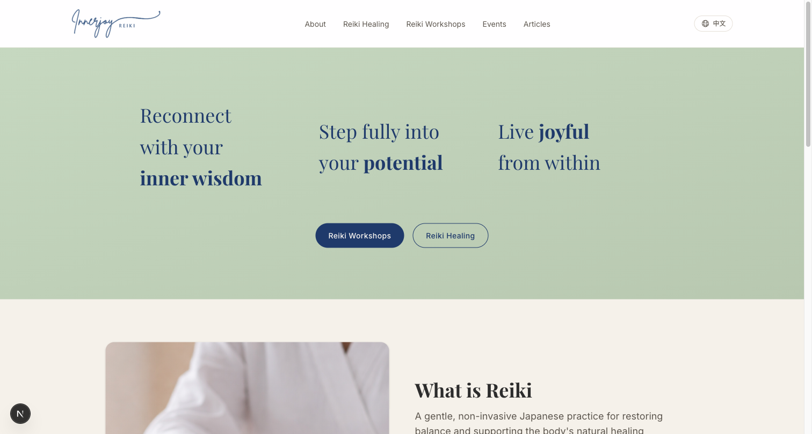
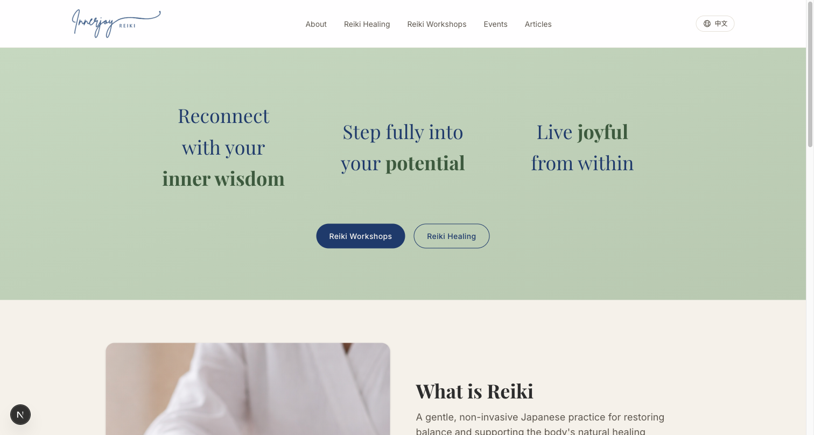
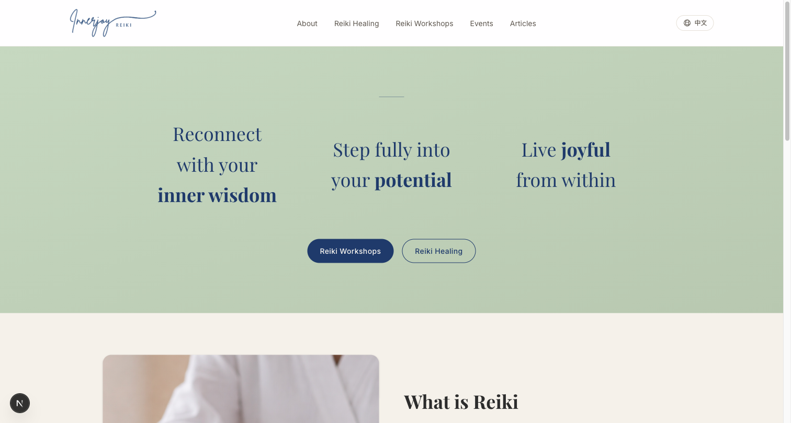
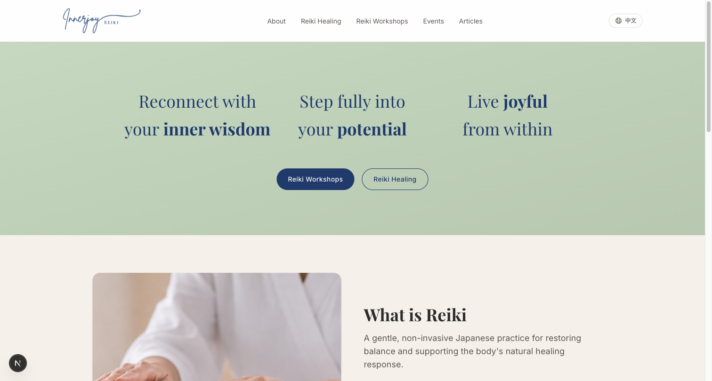

# Homepage hero typography + spacing explorations

Ten experiments testing typographic treatments and gap spacing for the three-tagline + two-CTA hero on `src/app/page.tsx`. Each holds these constants fixed (per the decoded client direction across rounds 3–4):

- **No content added or removed** — three taglines exactly as authored (round 3, doc-led), two CTAs (Workshops + Healing).
- **Text-only hero** — no portrait, no image, no trust strip.
- **Horizontal 3-col at desktop** — round 3.1 polish intent.
- **DRY against existing tokens** — Playfair `font-serif`, `text-hero-text` navy, sage gradient, `max-w-5xl` container, `items-center` grid alignment, primary navy CTA + outline navy CTA.

Only typographic treatment + grid gap varies between experiments.

## Why this round happened

The prior committed state used `font-semibold -tracking-[0.02em] text-2xl md:text-[1.65rem] lg:text-[1.875rem]` (weight 600, 24–30 px). Reviewer feedback: *still doesn't feel right*. Aggressive survey of 13 wellness / yoga / Reiki sites confirmed the diagnosis — that spec sits in an "awkward medium-loud zone" (too small to feel monumental, too heavy to feel airy). Measured peers split into two archetypes:

- **Big quiet** (The Class @ 120 px / font-thin; Penny Moss / Futura Light @ 60–90 px) — weight 100–400, size 40–72 px, default-to-zero tracking, leading 1.15–1.25.
- **Big confident** (Headspace / Apercu Bold @ 64 px; Reiki Glow @ 82 px) — weight 600–700, size 44–64 px, tracking -0.02 to -0.03 em, leading 1.05–1.1.

The 3-col horizontal layout caps practical size around 30–36 px (taglines need to fit columns), so "big quiet at constrained scale" is the right archetype. That's experiment **A**.

## ⚠️ Critical font-loading caveat (DRY-relevant)

`src/app/layout.tsx:22` loads Playfair Display with **only weights `["400", "700"]`**. Tailwind weight utilities don't generate new font files — they emit `font-weight: N` declarations that the browser resolves against loaded variants. So:

| Tailwind class | Requested weight | Actually rendered |
|---|---|---|
| `font-light` (300) | 300 | falls back to 400 |
| `font-normal` (400) | 400 | **400** ✓ |
| `font-medium` (500) | 500 | falls back to 400 (closer to 400 than 700) |
| `font-semibold` (600) | 600 | falls back to **700** |
| `font-bold` (700) | 700 | **700** ✓ |

**Implication:** the prior committed `font-semibold` (parent) + `font-bold` (strong emphasis) was rendering both at weight 700 — **no internal contrast between body and emphasised words**. That fully explains the "feels too heavy" + "doc emphasis doesn't read distinctly" complaints. The taglines were a wall of 700, with the bolded words invisible inside it.

This also means experiment **F (font-medium)** is byte-identical to **A (font-normal)** — both render at 400. F is included here as documentation, not a real option.

Future contributors: if you want to use weights outside `[400, 700]` in Playfair, extend the `Playfair_Display` config in `layout.tsx`. Otherwise stick to `font-normal` and `font-bold` — they're the only weights this font system actually distinguishes.

## Typography experiments (A–G)

| # | Variant | Tagline classes | `<strong>` classes | Structural change | Grade |
|---|---|---|---|---|---|
| **A** | **Light + airy (research baseline)** | `font-serif font-normal leading-relaxed text-[1.625rem] md:text-[1.875rem] lg:text-[2.25rem]` | `font-bold` | none | **A** |
| **B** | **Italic body + roman-bold emphasis** | `... + italic ...` | `font-bold not-italic` | none | A− |
| C | All italic + italic-bold emphasis | `... + italic ...` | `font-bold` (inherits italic) | none | B |
| D | Left-aligned within columns | A + `text-left` | `font-bold` | none | C+ |
| E | Forest-green color emphasis | A | `font-bold text-primary-light` | none | C+ |
| F | Mid weight 500 | `... font-medium ...` | `font-bold` | none | — (renders identical to A; font-loading caveat) |
| G | Decorative thin rule above triptych | A | `font-bold` | `
` above grid | C− |

## Spacing experiments (H–J) — grid `gap`

All built on top of the A typography baseline. Original committed gap was `gap-8 md:gap-6` (32 px stack / 24 px desktop).

| # | Variant | Grid classes | Effective gap @ desktop | Grade |
|---|---|---|---|---|
| H | Tight | `grid grid-cols-1 items-center gap-4 md:grid-cols-3 md:gap-3` | 12 px | C |
| **I** | **Spacious** | `grid grid-cols-1 items-center gap-12 md:grid-cols-3 md:gap-12` | 48 px | **A** |
| J | Very airy | `grid grid-cols-1 items-center gap-16 md:grid-cols-3 md:gap-16` | 64 px | B+ |

## Per-experiment notes

### A — Light + airy (research baseline) — Grade A

- **Mood**: airy, breathy, poetic. Matches "big quiet" archetype at constrained scale.
- **Brand fit**: pure typography, no additions, DRY (existing tokens only).
- **Hierarchy**: body weight 400 + emphasis weight 700 gives the largest possible weight contrast that this font config supports (see caveat above). The doc-bolded words ("inner wisdom" / "potential" / "joyful") now actually punctuate — they didn't in the prior committed state.
- **Pattern conformance**: divergence from `PageHeader` (weight 400 vs 600, leading relaxed vs snug, default vs negative tracking) is intentional and justified — peer-page H1 job is "identify" (one big anchored statement); home hero job is "mood" (three exhaled phrases).
- **Evidence**: matches research consensus for multi-phrase wellness hero copy treated as quote-block rather than confident headline.

### B — Italic body + roman-bold emphasis — Grade A−

- **Mood**: most distinctive of the corpus — reads as quoted aphorism / Zen verse. Editorial wellness voice (Tricycle / NY Times wellness column).
- **Brand fit**: pure typography. Introduces italic as a new axis the site doesn't use elsewhere; would live in the hero only.
- **Hierarchy**: best emphasis contrast of the seven — two-dimensional (italic body vs roman-bold emphasis), so the bolded words anchor with double-strength visual lift.
- **Risk**: italic is an aesthetic commitment. If the brand later wants a more "confident" voice, italic reads as the opposite.
- **Recommended as alternative to A** if Yin Ling wants the hero to lean explicitly editorial / contemplative rather than calm-neutral.

### C — All italic + italic-bold emphasis — Grade B

- Same italic voice as B, but emphasis is italic-bold (one axis, weight only) instead of italic + roman flip (two axes).
- **Hierarchy weaker** — the bolded words still pop but contrast is single-dimensional. B does this better.

### D — Left-aligned within columns — Grade C+

- **Fragments the triptych** — each column anchors its left edge, but the three columns no longer read as one composition.
- Centered alignment in A holds the three taglines as a single visual unit. Left-alignment is wrong for this structure.

### E — Forest-green color emphasis — Grade C+

- Computed color is correctly applied (`rgb(61, 90, 62)` = `--color-primary-light` forest green) — verified via DOM evaluation.
- **Visual problem**: forest green and navy have similar luminance values on sage. The hue shift is too subtle to function as emphasis at this size.
- Color emphasis works for warmer brand palettes; not for this navy-on-sage one without value contrast.

### F — Mid weight 500 — N/A (renders as A)

- `font-medium` (500) falls back to weight 400 because Playfair only loads 400 and 700 (see caveat above).
- Screenshot is byte-identical to A's. Documented for completeness; not a real option without extending the font config.

### G — Decorative thin rule above triptych — Grade C−

- Adds a 48 × 1 px hairline at 40% navy opacity above the triptych.
- Visually elegant in isolation.
- **But violates client direction**: round 4 (`4ee0f77`) explicitly stripped the eyebrow and supporting line "so the 3 taglines are the focal element." A decorative rule is functionally an eyebrow without text — the client's anti-addition signal applies. Not the winner unless the brand decides to revisit the round-4 stripping decision.

### H — Tight gap (12 px desktop) — Grade C

- Phrases compress toward each other. The triptych loses its breath; the three taglines start reading as one continuous block of text rather than three distinct beats.
- Wrong direction for the wellness mood goal.

### I — Spacious gap (48 px) — Grade A

- Each tagline claims its own visual space without disconnecting from the composition. The three phrases read as a triptych — clearly related, clearly distinct.
- Comfortable on desktop (where columns are ~280 px wide, 48 px gap = ~17% of column width) and on mobile (48 px stacked-line spacing matches the wellness archetype's generous leading).
- Best of the three spacing options.

### J — Very airy gap (64 px) — Grade B+

- Phrases drift toward feeling like 3 separate posters rather than 3 movements of one composition.
- Still readable, still calm — just over-spaced. The middle column starts to feel isolated.
- Not wrong, but I is the sweet spot.

## Final winner: A + I

**Applied as the final committed state.** Combines:
- **Typography A** — `font-normal` body, `font-bold` doc-emphasis, `leading-relaxed`, default tracking, scaled to 26 / 30 / 36 px across breakpoints
- **Spacing I** — `gap-12 md:gap-12` (48 px between phrases at every breakpoint)

Why it wins:
- Evidence-backed by the wellness/yoga site survey ("big quiet at constrained scale" archetype)
- Honors the discovered font-loading constraint (only weights 400 and 700 actually distinguish in Playfair)
- Fully DRY against existing tokens
- Treatment-only (no content added, no structural change)
- 3 phrases breathe as a triptych instead of crowding or fragmenting

## Optional next step: editorial voice (B)

If Yin Ling wants a more contemplative / editorial / Zen-aphorism mood, swap A for B (add `italic` to the tagline class + `not-italic` to the strong tags). Single-line change. Same spacing.

## Files modified by this exploration

- `src/app/page.tsx` (tagline className + grid className)
- `docs/hero-explorations/` (this folder — all screenshots and this README)

No new theme tokens added by this exploration. (The `--color-on-dark` token from the prior polish commit is still present from before this exploration.)
